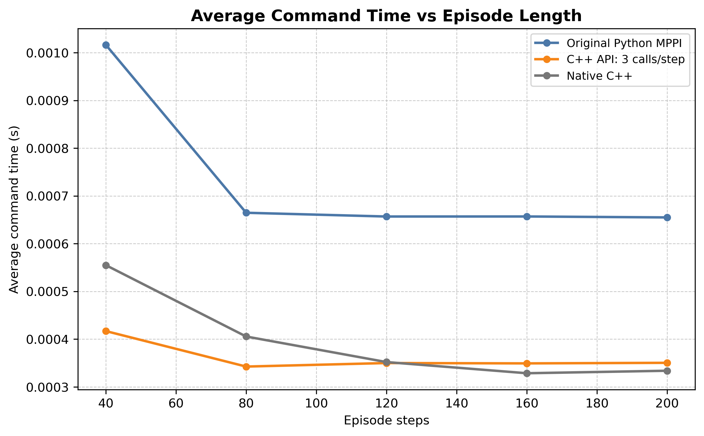
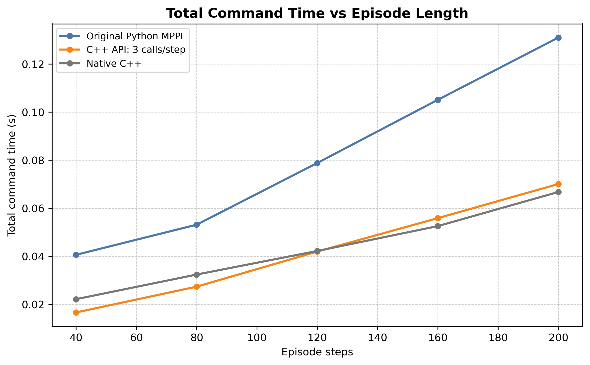
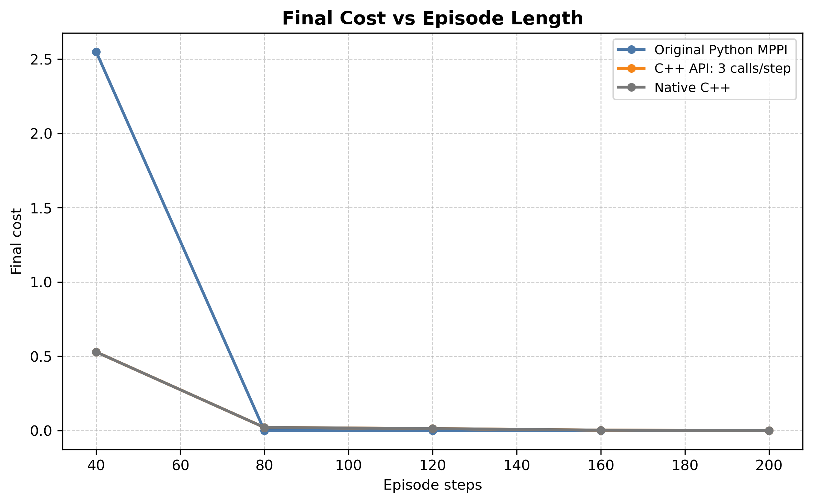
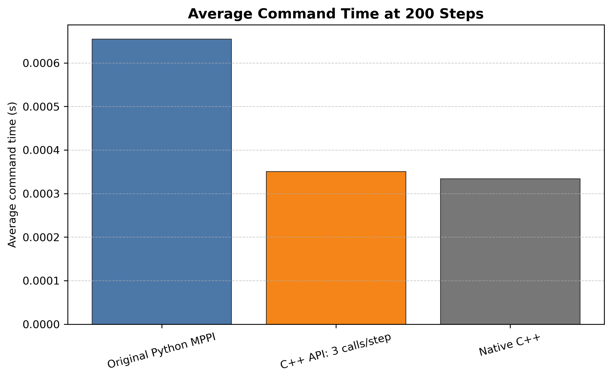

# Model Predictive Path Integral Control in C++

This project implements Model Predictive Path Integral Control (MPPI) and Smooth MPPI (SMPPI) controllers in C++. It includes pybind11 Python bindings, a Gym pendulum validation/demo workflow, CPU benchmarking tools, and CSV-based report plots for comparing Python and C++ execution paths.

The pendulum environment is used as the main validation and benchmarking example, while the controller architecture remains generic through reusable dynamics and cost interfaces.

## Features

- MPPI controller in C++
- Smooth MPPI controller
- Generic dynamics/cost architecture
- pybind11 Python bindings
- Gym pendulum demo
- Native C++ benchmark
- Python/C++ API benchmarks
- CSV-based benchmarking and plots
- OpenMP support
- CMake build system
- Unit tests

## Repository Structure

```text
.
├── include/                         # Public C++ headers
├── src/                             # Controller implementations
├── bindings/                        # pybind11 Python module
├── tests/                           # Unit tests, demos, benchmarks
├── examples/                        # C++ example programs
└── mppi_comparison/
    └── cpu_based/
        ├── data/                    # Benchmark CSV files
        └── plots/                   # Generated benchmark plots
```

## Build

Use a Release build for benchmark results.

```bash
cmake -S . -B build -DCMAKE_BUILD_TYPE=Release
cmake --build build --config Release
```

## Run Tests

```bash
ctest --test-dir build --output-on-failure
```

## Run Pendulum Demo

Run without rendering:

```bash
PYTHONPATH=build python tests/run_pendulum_gym_demo.py --steps 40
```

Run with Gym rendering:

```bash
PYTHONPATH=build python tests/run_pendulum_gym_demo.py --steps 40 --render
```

## Run Benchmarks

```bash
PYTHONPATH=build python tests/benchmark_original_python_mppi.py
PYTHONPATH=build python tests/benchmark_cpp_api_3_call.py
./build/benchmark_cpp_native
python mppi_comparison/cpu_based/plot_benchmark_results.py
```

Benchmark CSV files are saved in:

```text
mppi_comparison/cpu_based/data/
```

Plots are saved in:

```text
mppi_comparison/cpu_based/plots/
```

## Benchmark Explanation

The CPU benchmark compares three execution paths:

- **Original Python MPPI**: reference benchmark data from the original Python implementation.
- **C++ API: 3 calls/step**: Python controls the loop and calls C++ separately for `controller.command()`, `dynamics.propagate()`, and `cost.evaluate()`.
- **Native C++**: pure C++ benchmark executable without Python call overhead.

The C++ API benchmark keeps Python in control of the simulation loop while executing the controller, dynamics, and cost computations in C++ through pybind11.

## Results









## Technologies Used

- C++
- Eigen
- OpenMP
- pybind11
- Python
- Gym
- Matplotlib
- CMake

## Future Work

- CUDA rollout acceleration
- GPU parallel trajectory sampling
- More robotic environments
- Extended benchmarking

## Author

Mari Mkrtchyan
